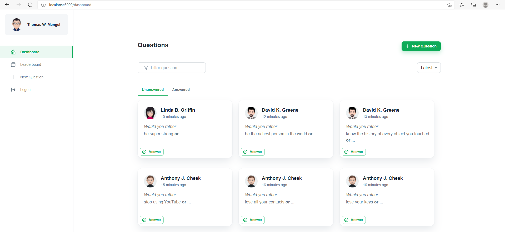

# Would You Rather

This is the final assessment project for [Udacity's React Nanodegree program](https://www.udacity.com/course/react-nanodegree--nd019).

[](https://app.netlify.com/sites/reactndp2-ofa/deploys)

- **Live Demo:** [https://reactndp2-ofa.netlify.com](https://reactndp2-ofa.netlify.com/)



## Installation

Clone the repository, change directories, and use NPM to install the dependencies.

```bash
$ git clone https://github.com/omerfarukakdag/reactnd-p2.git
$ cd reactnd-p2
$ npm install
```

## Usage

The project can be run with

- `npm start`

The project can be viewed in the browser at

- [http://localhost:3000](http://localhost:3000)

## Screenshots

### Login


### Dashboard


### Answered Questions


### Results


### New Question


### Filtering


### Leaderboard


- [Favicon](https://www.flaticon.com/authors/dailypm-studio)
- [Avatars](https://www.cartoonize.net)
- [404 Illustrator](https://craftwork.design)
